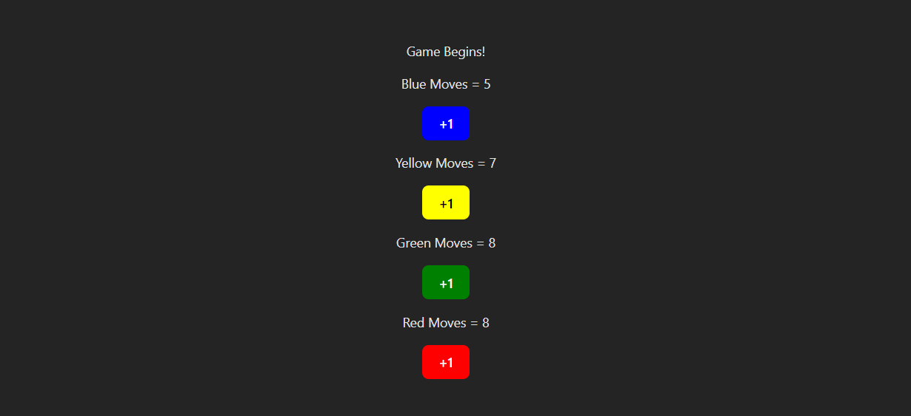

# 🎲 Ludo Move Counter (React)

A simple React-based project that simulates a **Ludo move counter**. Each player (Blue, Red, Yellow, Green) has a button to increase their move count. This project demonstrates **React useState**, event handling, and dynamic UI updates.

---

## 📸 Preview

<p align="center">
  
</p>

---

## 🚀 Features

- Track moves for 4 players (Blue, Red, Yellow, Green)
- Real-time UI updates using React state
- Simple and beginner-friendly UI
- Uses functional components and hooks

---

## 🧠 What You Learn

- React `useState` hook
- Updating state using previous state
- Event handling in React
- Managing multiple values in one state object

---

## 📂 Project Structure
ludo-move-counter
├── src
│ ├── App.jsx
│ └── LudoBoard.jsx
├── screenshot.png
├── index.html
├── package.json
└── README.md


---

## ▶️ How to Run

1. Clone the repository:
   ```bash
   git clone https://github.com/your-username/ludo-move-counter.git
---

## ▶️ How to Run

1. Clone the repository:
   ```bash
   git clone https://github.com/your-username/ludo-move-counter.git

2. Navigate to project folder:
   
   cd ludo-move-counter

4. Install dependencies:
   
   npm install

4. Start development server:
   
   npm run dev
   
6. Open in browser:
   
   http://localhost:5173

## 🛠 Tech Stack

   - React
   - JavaScript (ES6)
   - HTML
   - CSS
   
## 📄 License

   This project is free to use for learning and practice.

## ⭐ If you like this project, consider giving it a star!
